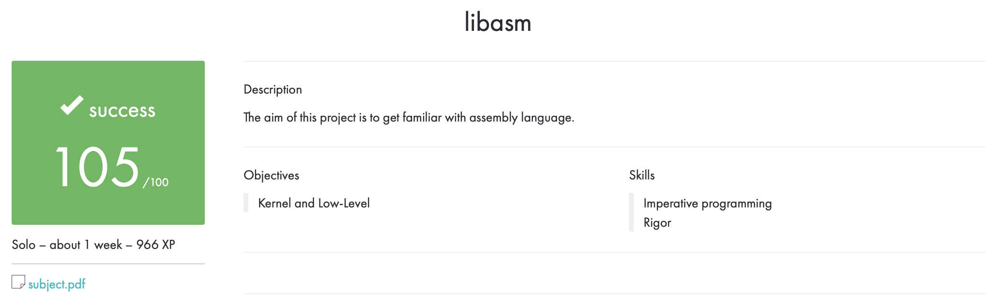

# libasm

## Описание

Цель этого проекта - познакомиться с языком Ассемблер.

Компилирование файлов ``.s`` было с флагами: ``nasm -f macho64``.

Компилирование файлов ``.c`` было с флагами: ``gcc -Wall -Wextra -Werror``.

Файлы ``.c`` проходят на ``Norminette``.

## Использование

``make`` и ``make all`` собирают библиотеку, или перекомпилирую измененный файл, так же пересобирая библиотеку.

``make bonus`` собирает библиотеку с бонусами.

``make re`` удаляет все ``.o`` файлы, удаляет ``libasm.a``, пересобирает библиотеку.

``make clean`` удаляет все ``.o`` файлы.

``make fclean`` удаляет все ``.o`` файлы, так же удаляет ``libasm.a``.

## Оценка

## my_test

По заданию вместе с проектом должны идти тестеры функций. Достаточно скомпилировать ``main.c`` и ``main_bonus.c``.
